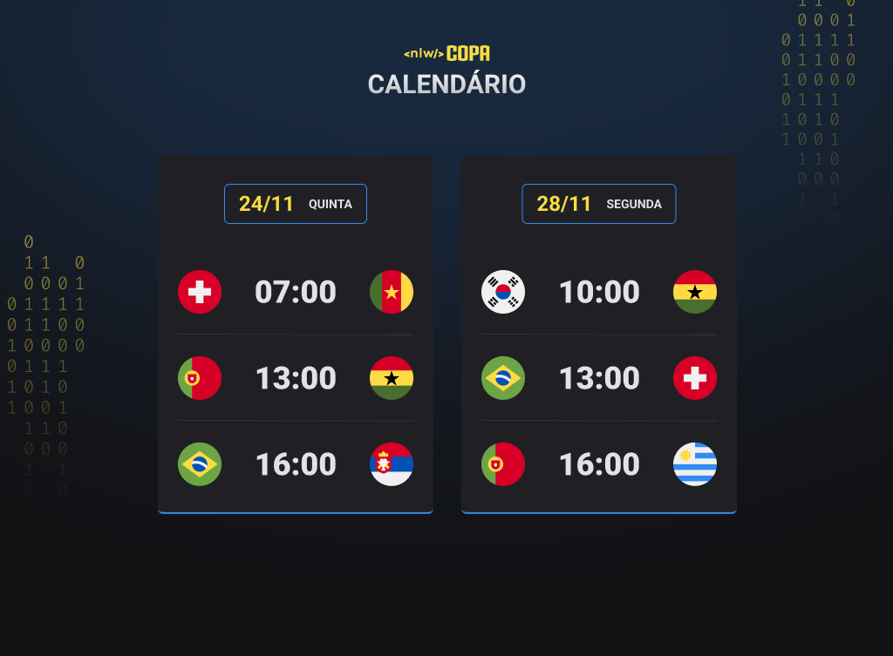

  

  
  

## 💻 Projeto

O Calendário da Copa é um projeto que mostra os jogos da Copa de 2022.

## ✨ Tecnologia

- HTML e CSS
- JavaScript
- Git e GitHub

## 🔖 Layout

Você pode visualizar o layout do projeto através do link abaixo:

- [Layout](https://www.figma.com/file/fPWahFkQC7zf4AUgGC64SY/Calend%C3%A1rio-de-Jogos-(Community)?node-id=0%3A1)

Lembrando que você precisa ter uma conta no [Figma](http://figma.com/).

## 📝 License

Esse projeto está sob a licença MIT. Veja o arquivo [LICENSE](LICENSE) para mais detalhes.

---

  Feito por Lucas Xavier 
  lucasxavierfecontato@gmail.com

